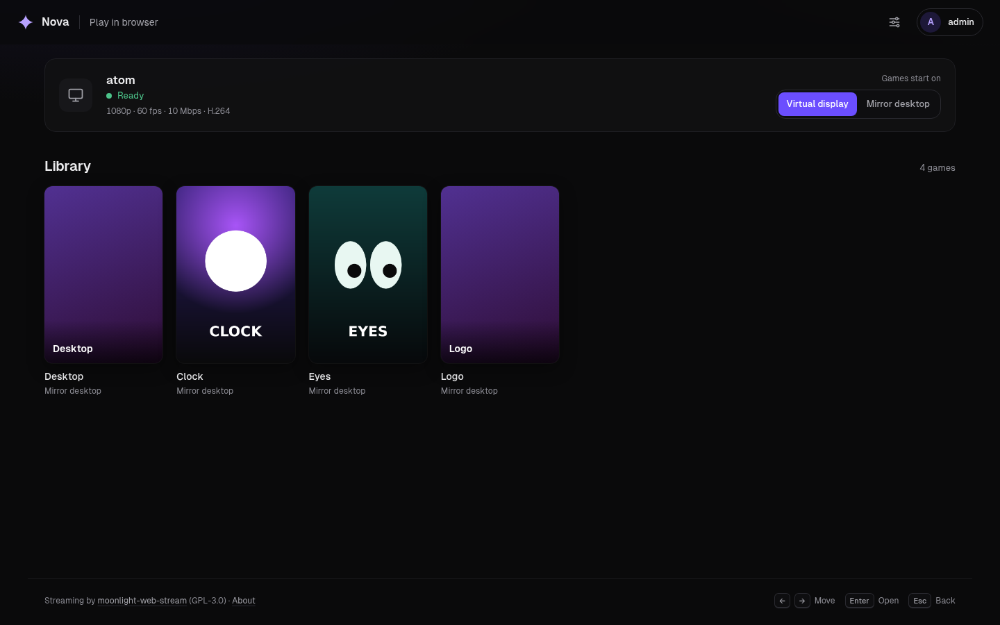
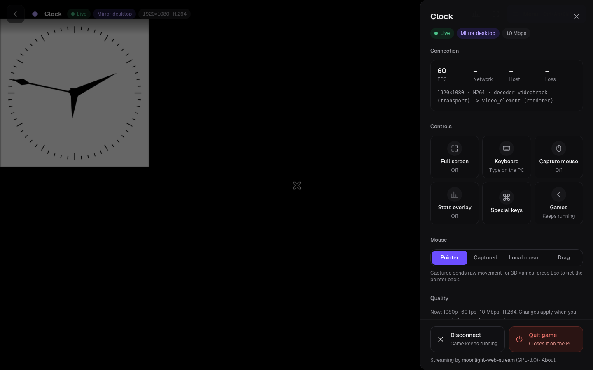
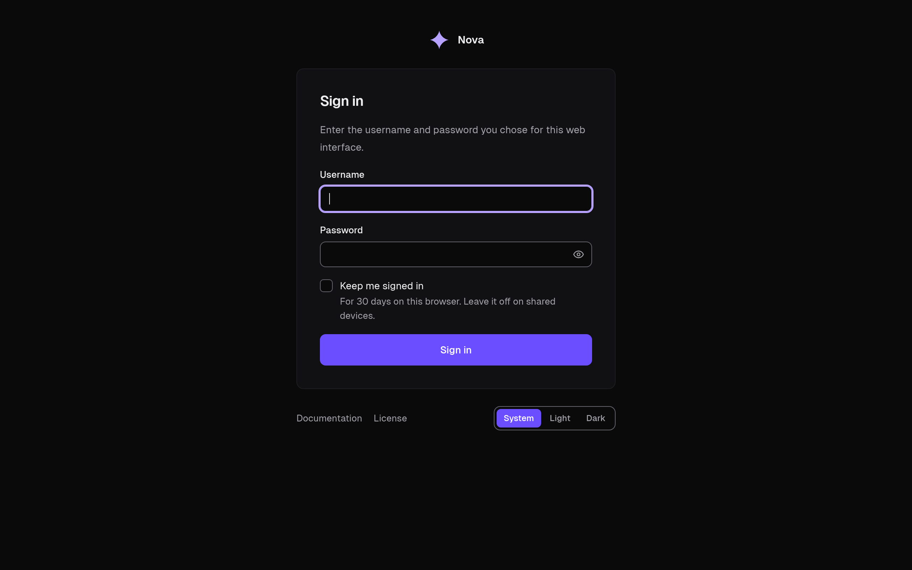
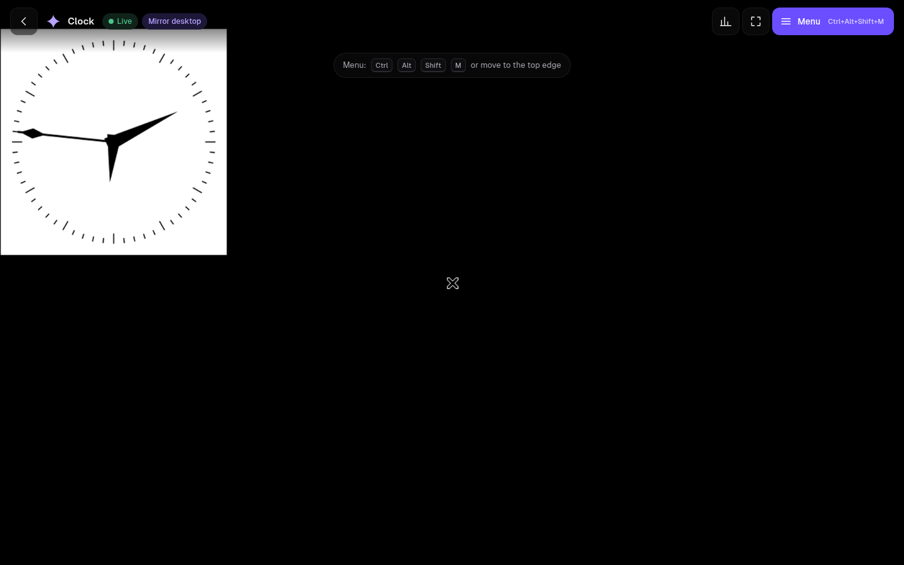

  
  <h1 align="center">Nova</h1>
  <h4 align="center">Linux-first, self-hosted game stream host for Moonlight and Nebula.</h4>

  
  
  
  
  

 

  

Nova streams your Linux PC's desktop and games to phones, tablets and TVs. It works with any
Moonlight client, and pairs best with [Nebula](https://github.com/F-e-n-y-x/nebula), its companion
Android app.

## Features

<table>
  <tr>
    <td></td>
    <td></td>
  </tr>
  <tr>
    <td></td>
    <td></td>
  </tr>
</table>

**Displays**
- 🪞 **Mirror** — your desktop resizes to the device's exact screen size and refresh, then
  restores when you disconnect.
- 🖥️ **Virtual display** — a separate desktop created just for the stream, at the device's size,
  with your wallpaper, icons and a taskbar. Your own desktop, windows and cursor stay untouched; the
  stream gets its own mouse, keyboard and audio. It survives quick reconnects and resolution changes.
- 📱 **Portrait streaming** and **desktop scaling** (100–200 %) on the virtual display.

**Streaming**
- 🎮 **Native NVENC with loss recovery** — on a lost packet only the damaged frames are repaired
  (reference-frame invalidation), so the picture stays sharp instead of going soft for half a
  second. Works on older GeForce cards too (GTX 900/1000, CUDA 12.9), with zero-copy NvFBC capture.
  Falls back to FFmpeg NVENC automatically (`nvenc_backend`).
- 📶 **Adaptive bitrate** — lowers and raises the bitrate live with the network, never above your
  setting or the game's limit; plus a **connection test** that suggests a bitrate.
- 🖱️ **Local cursor** — the device draws the PC's pointer itself, so it moves instantly; the video
  carries no second pointer.
- ⌨️ **Auto keyboard** — tapping a text field on the PC opens the device's keyboard (or Nebula's PC
  keyboard), and closes it when you leave. Field contents are never read.
- 🕹️ **Controllers that just work** — correct layout in browsers, Steam, SDL and Proton games; one pad
  per device, player 1 always the one you use, the game keeps its pad across reconnects, and
  DualSense motion for gyro-capable phones.
- 🎤 **Remote microphone** ("Nova Mic") and 📋 **clipboard sync**, both ways.

**Play in a browser**
- 🌐 Stream any game to a web browser on your home network or Tailscale — no app needed. Sign in
  with your Nova login, pick a game, play with keyboard, mouse or a gamepad. Off by default.
  Built on [moonlight-web-stream](https://github.com/MrCreativ3001/moonlight-web-stream).

**Library**
- 📚 **Game library** — add games from a folder, Lutris or Steam. Artwork, logos and details are
  fetched automatically (Steam, SteamGridDB, IGDB), with custom artwork by upload, URL or search.
- 🎚️ **Per-game settings** — frame-rate limit, FSR, sharpening, MangoHud, a bitrate limit and power
  mode per game, set in the web UI or from Nebula.
- 🍷 **Windows games** — run through GE-Proton (umu) with a separate prefix per game; Lutris optional.

**Web UI & devices**
- 🎨 **Redesigned web UI** — live desktop preview, stream bar with a network graph, dark and light.
- 🔐 **Per-device permissions** — decide what each paired device may do; rename or unpair anytime.
- 🏷️ **Auto device names** — pairing fills in the name for you, e.g. *Nebula from Ayush's S25 Ultra*.
- 📈 **Session history & health checks** — what streamed, how well, and what needs attention.
- 🔑 **Sign-in page** with secure sessions, "keep me signed in" and a lockout after wrong passwords.
- 😴 **Sleep and Wake-on-LAN** from the device, and **host commands** you define (per-device permission).
- ⚡ **Streaming power mode** (max GPU clocks while streaming) and **one-click updates** from releases.

See [ROADMAP.md](ROADMAP.md) for what's next.

## Install

Download the [latest release](https://github.com/F-e-n-y-x/nova-host/releases/latest):

| Platform | Package | Install |
|----------|---------|---------|
| **Ubuntu / Debian / Mint** | `nova-host-*-amd64.deb` | `sudo apt install ./nova-host-*.deb` |
| **Fedora / Nobara / Bazzite** | `nova-host-fedora-*-x86_64.rpm` | `sudo dnf install ./nova-host-*.rpm` |

Then open `https://<host-ip>:47990`, create a login, and pair Nebula or Moonlight.
Settings live in `~/.config/nova-host/`. Nova replaces the `sunshine` and `zenith` packages and
copies their settings over on first start.

Building from source: see the [local build notes](docs/building_nova_local.md).

## Versioning

Numeric [semantic versioning](https://semver.org), tagged `nova-vX.Y.Z`. Everything before
**1.0.0** is a pre-release.

## Credits & license

Developed by [Fenyx](https://github.com/F-e-n-y-x).
Nova is a fork of [Zenith](https://github.com/jacksonpate/zenith) by Jackson Pate, itself a fork of
[LizardByte/Sunshine](https://github.com/LizardByte/Sunshine) — go star them. Feature ideas from
[Apollo](https://github.com/ClassicOldSong/Apollo) and
[Sunshine-Foundation](https://github.com/AlkaidLab/foundation-sunshine), reimplemented for Linux.

Licensed [GPL-3.0](LICENSE). Third-party notices: [NOTICE](NOTICE).
