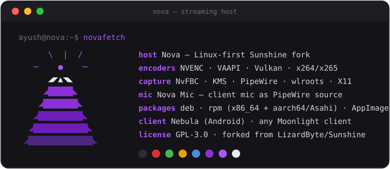

  
  <h1 align="center">Nova</h1>
  <h4 align="center">Linux-first, self-hosted game stream host for Moonlight — a fork of Zenith and Sunshine.</h4>

  
  
  
  
  

 

  

## Why Nova

The best Sunshine forks (Apollo, Sunshine-Foundation) are Windows-only because their headline
features are built on Windows virtual display drivers. Nova, like Zenith before it, ports the
*ideas* everywhere — the native way on Linux (PipeWire, KMS/DRM, Wayland) and with a bundled
signed driver on Windows — with NVIDIA **and** AMD as first-class citizens. Install it, pick
**Headless** in Moonlight, and a virtual display spins up at your client's exact resolution and
refresh. Its companion Android client is [Nebula](https://github.com/F-e-n-y-x/nebula).

- 🖥️ **Plug-and-play virtual displays** — "Headless" and "Dual" work out of the box on
  Linux (KDE, GNOME, Sway/wlroots, Cinnamon) and on Windows (bundled signed SudoVDA driver).
  The display is *born when the app launches and destroyed when it quits*, at exactly the
  client's resolution and refresh.
- 📍 **It stays where you put it** — the streaming display's position and zoom come back next
  session, even if you rezoomed your monitor or connected from a different device in between.
- 🔌 **No kernel module on most machines** — if the host has a spare port, Nova borrows it:
  a generated EDID on a real connector, on the same GPU that will encode it. Machines with every
  port occupied fall back to EVDI, which `nova-display setup` installs.
- 🎤 **Remote microphone** — your phone's mic shows up on the host as a real input device
  ("Nova Mic") that Discord and games can use. On by default.
- 📋 **Clipboard sync, both ways** — text or images, over the paired TLS connection.
  Wire-compatible with VoidLink and the Foundation-family clients.
- 📁 **File transfer to the client** — push a file from the host to your connected device. *Beta.*
- ⚡ **Present-paced capture** — KMS capture wakes on real display vblanks instead of a
  timer (`capture_pacing = auto`); NVIDIA falls back to timer pacing automatically.
- 🎮 **NVENC on older GeForce cards** — x86_64 packages are built with CUDA 12.9, so GTX 900/1000
  (Maxwell/Pascal) and Volta GPUs keep hardware encoding, from NVIDIA driver 455 up.

See [ROADMAP.md](ROADMAP.md) for what's next.

## Install

Download the [latest release](https://github.com/F-e-n-y-x/nova-host/releases/latest) for your
platform:

| Platform | Package | Notes |
|----------|---------|-------|
| **Windows 10/11** | `nova-host-Windows-AMD64-installer.msi` | Bundles the virtual display driver. Untested since the rename. |
| **Ubuntu / Debian / Mint** | `nova-host-*-amd64.deb` | `sudo apt install ./nova-host-*.deb` |
| **Fedora / Nobara / Bazzite** | `nova-host-fedora-*-x86_64.rpm` | `sudo dnf install ./nova-host-*.rpm` |
| **Asahi Linux (Apple Silicon)** | `nova-host-fedora-*-aarch64.rpm` | Fedora Asahi Remix. |

Then open `https://<host-ip>:47990`, set a username and password, and pair Moonlight or Nebula.
Nova installs the `nova-host` binary and the `app-io.github.f_e_n_y_x.NovaHost` user service
(aliased `nova-host.service`), and keeps its settings in `~/.config/nova-host/`
(`nova-host.conf`, `nova-host.log`). The Linux packages *Conflict with* and *Replace* the
`zenith` and `sunshine` packages, so installing Nova supersedes either rather than running a
second host on the same ports.

**Coming from Zenith or Sunshine:** the first time Nova starts, it copies your old settings folder
(`~/.config/sunshine/`) to `~/.config/nova-host/`, renaming `zenith.conf` (or `sunshine.conf`) to
`nova-host.conf`. Pairings, web UI login, apps and covers come along; the old folder is left
untouched, so you can go back.

Prefer to build from source? See the [local build notes](docs/building_nova_local.md).

## Versioning

Nova uses numeric [semantic versioning](https://semver.org). Releases are tagged `nova-vX.Y.Z`
(the history also carries Sunshine's old `v0.x` and the date-based Zenith/Sunshine tags, so plain
`v*` tags are not used). Everything before **1.0.0** is a pre-release (`0.x`); 1.0.0 is the first
release considered stable. Local builds report the nearest `nova-v*` tag (or the version in
`CMakeLists.txt` when there is none) plus the commit, for example `0.1.0-0710b321`.

## Troubleshooting

If a virtual display misbehaves, `nova-display doctor` prints what Nova can see of your
machine — session, compositor, connectors, and which provider it would use and why. Include that
in an [issue](https://github.com/F-e-n-y-x/nova-host/issues).

## Credits & license

Nova is developed by [Fenyx](https://github.com/F-e-n-y-x) (ayushsoni2911@gmail.com).

Nova is a fork of [Zenith](https://github.com/jacksonpate/zenith) by Jackson Pate, which is itself
a fork of [LizardByte/Sunshine](https://github.com/LizardByte/Sunshine). It stands on their work —
go star them, and read Sunshine's
[documentation](https://docs.lizardbyte.dev/projects/sunshine/latest/), which applies to Nova for
everything not listed above. Feature inspiration from
[Sunshine-Foundation](https://github.com/AlkaidLab/foundation-sunshine) and
[Apollo](https://github.com/ClassicOldSong/Apollo), reimplemented for Linux.

Licensed [GPL-3.0](LICENSE), same as upstream. Third-party notices: [NOTICE](NOTICE).
